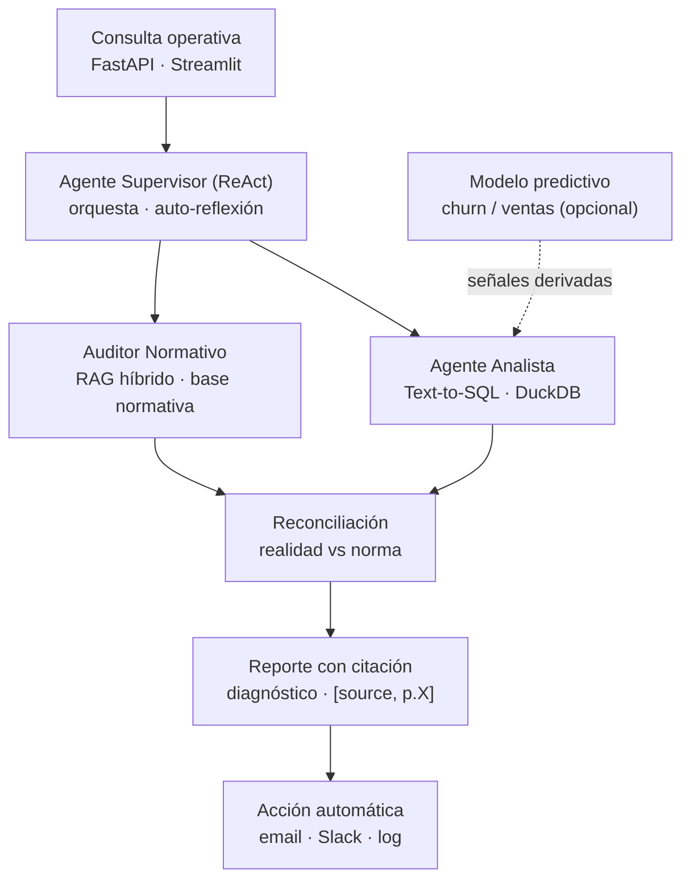

# Gemelo Digital Operativo (GDO) — Diseño del sistema

**Proyecto Procesamiento de Lenguaje Natural III (FIUBA / CEIA)**
Sistema agéntico de diagnóstico operativo para una cadena de tiendas de ventas retail, basado en RAG avanzado y Text-to-SQL.

> **Alcance actual:** el prototipo se construye con **dos agentes** (Analista Text-to-SQL + Auditor Normativo RAG) sobre las tablas Excel y la base de conocimiento.

---

## 1. Objetivo del proyecto

Construir un **gemelo digital operativo (GDO)** por punto de venta (PDV) que permita *consultar qué ocurrió en la realidad* (las tablas de hechos: ventas y encuestas) y *resolverlo contra la norma* (la base de conocimiento: `manual_operativo_completo.md` + carpeta `recursos`), produciendo un **diagnóstico fundamentado con citación direccionable** y disparando una **acción automática**.

El "gemelo digital" se materializa en un **objeto de estado por PDV** que combina las siguientes capas:

| Capa | Fuente | Naturaleza |
|---|---|---|
| Perfil estructural | diseño funcional de tiendas, capacidad de frío | Estático (configuración del local) |
| Hechos dinámicos | `datos-ventas.xlsx`, encuestas +/– | Transaccional / serie temporal |
| Norma aplicable | `manual_operativo_completo.md`, `recursos/` | Conocimiento gobernante (RAG) |

El sistema responde preguntas del tipo: *"¿Por qué cayó la satisfacción en la sucursal Centro los sábados a la noche?"* → detecta el desvío en los datos, lo contrasta con el protocolo correspondiente, y devuelve causa raíz + acción correctiva citada.

---

## 2. Arquitectura general

### 2.1 Flujo de ejecución (multi-agente ReAct)



### 2.2 Descripción de componentes

- **Interfaz (orquestación de interacciones).** API REST con **FastAPI** (endpoints `/diagnose`, `/health`, `/state/{pdv_id}`) + front liviano en **Streamlit** para demo visual. FastAPI cumple el requisito de "API funcional para orquestar interacciones entre usuarios, agentes y modelos".
- **Estado del gemelo (`TwinState`).** Objeto Pydantic hidratado por PDV: perfil estructural + KPIs recientes + protocolos vinculados (+ señales predictivas si el componente opcional está activo). Es la "memoria" compartida entre agentes (estado del grafo en LangGraph).
- **Agente Supervisor.** Implementa el patrón **ReAct** sobre **LangGraph**: razona, decide qué herramienta/agente llamar, observa el resultado y reflexiona. Incorpora la lógica de **auto-evaluación** (ver §4) — si la evidencia recuperada es insuficiente o contradictoria, reescribe la consulta y vuelve a recuperar antes de concluir.
- **Agente Analista (Text-to-SQL).** Traduce la pregunta a SQL sobre **DuckDB** (las 3 tablas Excel cargadas como vistas). Devuelve los hechos cuantitativos: caída de ventas, tiempo de ticket, sentimiento de encuestas por sucursal/franja horaria.
- **Auditor Normativo (RAG avanzado).** Recupera el protocolo aplicable desde la base de conocimiento y verifica cumplimiento. Es el núcleo RAG (ver §3).
- **Reconciliación + Reporte.** El supervisor compara hechos vs norma, genera el diagnóstico (causa raíz + acciones sugeridas) con citas `[fuente, p.X]`.
- **Actuador.** Dispara la acción de salida (ver §8).
- **Capas transversales:** seguridad (§6), optimización (§7) y observabilidad/logging (§9).

---

## 3. RAG avanzado (Auditor Normativo)

El requisito pide "recuperación semántica + modelos tipo retriever-ranker, con relevancia y trazabilidad de fuentes". Se implementa el pipeline avanzado de la clase 1 (pre-retrieval → retrieval → post-retrieval), justo el ejemplo de las slides 43-44.

### 3.1 Ingesta e indexación
- **Corpus:** `manual_operativo_completo.md` (transcripciones de videos) + todos los archivos de `recursos/` (planillas modelo, criterios de auditoría, manual de cámara de frío, manual de mercadería/capacidad de frío, diseño funcional de tiendas).
- **Chunking:** por estructura (headers markdown) + ventana semántica con solapamiento. Metadatos por chunk: `doc_id`, `page/section`, `source`, `tipo_doc` (protocolo / auditoría / cámara-frío / layout).
- **Índice doble:**
  - **Denso:** embeddings `all-MiniLM-L6-v2` (normalizados, coseno) en **Pinecone** o FAISS local, con soporte de `namespace` y `meta_filter`.
  - **Disperso (sparse):** **BM25** sobre los mismos chunks (búsqueda léxica, útil para términos exactos: códigos de protocolo, nombres de equipos).

### 3.2 Recuperación híbrida + re-ranking
1. **Pre-retrieval:** query routing (¿qué tipo de doc aplica?) + query rewriting cuando la consulta es vaga.
2. **Retrieval:** BM25 y denso en paralelo (top-k cada uno).
3. **Fusión (RRF):** Reciprocal Rank Fusion `1/(k+rank)` para combinar ambas listas sin normalizar puntajes.
4. **Re-ranking:** **Cross-Encoder** (MS MARCO MiniLM) puntúa pares `(query, chunk)` y refina el orden final.
5. **Diversidad:** `per_doc_cap` + deduplicación por `doc_id` para que un solo documento no monopolice el top-k.
6. **Construcción de contexto:** se arma el contexto con `[source, p.X]` por chunk → **citación direccionable** (trazabilidad de fuentes, requisito explícito).

### 3.3 Variante elegida y justificación
Se adopta **Agentic RAG + Corrective RAG (CRAG)**: el supervisor decide *cuándo* recuperar, y un evaluador de recuperación clasifica los documentos como `correcto / ambiguo / incorrecto`; si son ambiguos/incorrectos, reescribe la query y reintenta. Esto cubre el requisito de "agentes autoreflexivos" y el de "relevancia del contenido recuperado".

---

## 4. Agentes y comunicación dinámica

Requisito: ≥2 agentes con roles diferenciados, prompts estructurados, mensajes reflexivos/cadenas de razonamiento y auto-evaluación. **Con el Analista y el Auditor (+ Supervisor) el requisito de ≥2 agentes queda cubierto**, independientemente del componente predictivo opcional.

| Agente | Rol | Entrada | Salida | Mecanismo |
|---|---|---|---|---|
| Supervisor | Planificador / reconciliador | Consulta del usuario + estado del twin | Plan + diagnóstico final | ReAct + reflexión (CRAG) |
| Analista | Cuantificar la realidad | Pregunta NL | Tabla de hechos + SQL ejecutado | Text-to-SQL con validación de schema |
| Auditor Normativo | Recuperar y verificar la norma | Sub-pregunta + hechos | Protocolo + cita + veredicto cumple/no | RAG híbrido + grader |

**Comunicación dinámica:** estado compartido en LangGraph + mensajes estructurados (JSON con `claim`, `evidence`, `source`, `confidence`). **Auto-evaluación:** el grader de recuperación + un nodo de "reflexión" que verifica que cada afirmación del reporte esté respaldada por evidencia citada (estilo Self-RAG: tokens de crítica → reintento si baja calidad).

---

## 5. Medidas de seguridad

Requisito: control de acceso, filtrado de inputs, validación de outputs, auditoría continua.

- **Control de acceso:** API key / token por rol en FastAPI; los endpoints de acción quedan detrás de autenticación. **No hardcodear tokens** (cargar de variables de entorno / `.env`).
- **Filtrado de inputs:** sanitización de la consulta; en Text-to-SQL, ejecución **read-only** sobre DuckDB y allow-list de tablas (previene inyección SQL y operaciones destructivas).
- **Validación de outputs:** el SQL generado se valida contra el schema antes de ejecutar; el reporte final pasa por el chequeo de "toda afirmación citada"; salidas estructuradas validadas con Pydantic.
- **Auditoría continua:** logging estructurado de cada decisión del agente, query, fuente recuperada y acción disparada (trazabilidad completa para revisión).

---

## 6. Optimización de costos y latencia

Requisito: al menos una acción para reducir costo/latencia. Se incluyen varias:

- **Selección dinámica de modelo (model routing):** preguntas simples → LLM liviano (local vía Ollama); reconciliación compleja → modelo mayor.
- **Caching:** caché de embeddings y de respuestas a consultas frecuentes.
- **Compresión de contexto:** resumen (RAG Summary) de los chunks recuperados antes de pasarlos al generador → menos tokens, mismo recall.
- **Batching** de embeddings en la ingesta y control de `temperature` / `token_limit` por agente.

---

## 7. Acción final disparada automáticamente

Requisito: ejecutar una acción de salida automatizada. Opciones (elegir ≥1):

- **Email** (Gmail API o SMTP): enviar el reporte de diagnóstico al responsable de la sucursal.
- **Slack / Webhook:** notificar el desvío detectado a un canal de operaciones.
- **Log externo:** registrar el evento de diagnóstico para seguimiento histórico.

Recomendado para la demo: email vía SMTP + registro en log (simple, robusto, fácil de mostrar).

---

## 8. Evaluación y métricas

Alineado a la taxonomía de la slide 44 de la clase 1:

- **Retrieval:** Recall@k (meta ≥ 0.85 @20), nDCG@k, MRR, Hit rate@k, diversidad/de-dup, latencia p50/p95 del retriever.
- **Contexto:** Context Precision, Context Recall (coverage), % de citación direccionable, compresión efectiva.
- **Generación:** Exactitud (EM/F1) sobre un set con ground truth, Faithfulness/Attribution, hallucination rate, abstención correcta, % de SQL válido, citación correcta.
- **Re-rank / Fusión:** nDCG lift del Cross-Encoder sobre el candidato inicial; ganancia del híbrido (RRF) vs cada señal por separado (comparación pre-RRF vs post-CrossEncoder).
- **Agentes:** coherencia de decisiones, calidad del diálogo entre agentes, redundancia evitada, latencia.
- **Modelo:** tiempo de respuesta, consumo de tokens, similitud semántica (BLEU/ROUGE/semantic similarity).
- **Robustez & seguridad:** caída de métricas ante paráfrasis/typos, OOD/domain shift, filtrado de PII, resistencia básica a jailbreak.
- **Operación (SLOs):** latencia end-to-end (p50/p95), costo por respuesta (tokens/$), tasa de errores (timeouts, context overflow).

**Set de evaluación sugerido:** construir ~20-30 preguntas operativas con su `ground truth` (chunk correcto + respuesta esperada), generadas semiautomáticamente con un LLM a partir del manual y revisadas a mano.

---

## 10. Estructura de código (nivel preproducción)

Basada en el Cookiecutter Data Science adaptado a LLMs/agentes (slides 7-8):

```
gdo/
├── README.md
├── requirements.txt
├── config.yaml                  # parámetros externos (no hardcode)
├── .env.example                 # tokens / API keys
├── data/
│   ├── raw/                     # datos-ventas.xlsx, encuestas-*.xlsx, recursos/
│   ├── interim/
│   └── vectorstore/             # índice FAISS/Pinecone
├── src/
│   ├── interface/
│   │   ├── api.py               # FastAPI
│   │   └── app.py               # Streamlit
│   ├── twin/
│   │   └── state.py             # TwinState (Pydantic)
│   ├── agents/
│   │   ├── supervisor.py        # ReAct + reflexión (LangGraph)
│   │   ├── analyst_sql.py       # Text-to-SQL
│   │   └── auditor_rag.py       # RAG híbrido
│   ├── rag/
│   │   ├── ingest.py            # chunking + metadatos
│   │   ├── retrievers.py        # BM25 + denso
│   │   ├── fusion.py            # RRF
│   │   ├── reranker.py          # Cross-Encoder
│   │   └── summary.py           # compresión de contexto
│   ├── data_layer/
│   │   └── duckdb_loader.py     # Excel → vistas SQL
│   ├── security/
│   │   ├── guards.py            # filtrado input / validación output
│   │   └── auth.py
│   ├── actions/
│   │   └── notifier.py          # email / Slack / log
│   └── eval/
│       └── metrics.py           # Recall@k, nDCG, MRR, faithfulness...
├── tests/                       # pytest sobre partes críticas
└── notebooks/                   # EDA y experimentos
```

Buenas prácticas de preproducción (slide 11): código modular, configuración externa (`config.yaml`), logging con niveles, manejo de errores (`try/except` en funciones críticas), control de versiones (Git), pruebas con `pytest`, y registro de experimentos con **MLflow**.

---

## 11. Stack tecnológico

| Componente | Herramienta |
|---|---|
| Orquestación de agentes | LangGraph / LangChain |
| LLM | Ollama (local) + API según routing |
| Embeddings | `all-MiniLM-L6-v2` (HuggingFace) |
| Vector store | Pinecone / FAISS |
| Sparse retrieval | BM25 (`rank_bm25`) |
| Re-ranker | Cross-Encoder MS MARCO MiniLM |
| Datos / SQL | DuckDB + pandas |
| Modelo predictivo (opcional) | lifelines / lifetimes (churn) · Prophet / LightGBM (ventas) |
| API / Front | FastAPI + Streamlit |
| Registro / observabilidad | MLflow + logging |
| Tests | pytest |

---

## 12. Planificación del equipo (plantilla)

| Tarea | Responsable | Estado |
|---|---|---|
| Ingesta + chunking del corpus (manual + recursos) | | Pendiente |
| Carga de Excel a DuckDB + Text-to-SQL | | Pendiente |
| Pipeline RAG híbrido (BM25 + denso + RRF + Cross-Encoder) | | Pendiente |
| Supervisor ReAct + reflexión (LangGraph) | | Pendiente |
| Seguridad (auth, guards, validación SQL) | | Pendiente |
| Acción automática (email/Slack/log) | | Pendiente |
| Set de evaluación + métricas | | Pendiente |
| API/Streamlit + integración end-to-end | | Pendiente |
| (Opcional) Modelo predictivo churn/ventas → señales derivadas | | Diferido |
| Informe + presentación (15 min) | | Pendiente |

---

## 13. Mapeo requisito → componente (checklist de la consigna)

| Requisito de la consigna | Dónde se cumple | Estado |
|---|---|---|
| API funcional (FastAPI/Streamlit) | §2.2 Interfaz | OK |
| ≥2 agentes con comunicación dinámica + auto-evaluación | §4 (Supervisor + Analista + Auditor) | OK |
| RAG (retriever-ranker, relevancia, trazabilidad) | §3 | OK |
| Medidas de seguridad | §6 | OK |
| Modelo preexistente para inferencia (CNN/ViT) | §5 (sustituido por modelo predictivo churn/ventas) | **Abierto / diferido — confirmar con cátedra** |
| Flujo modular completo y monitoreable | §2, §10 | OK |
| Optimización de costos y latencia | §7 | OK |
| Acción final automática | §8 | OK |
| Evaluación y métricas (modelo / agentes / RAG) | §9 | OK |
